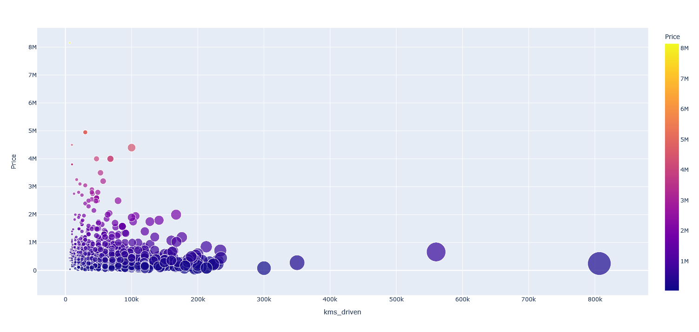

# Predicto
👉 Pause a moment here and have a look at this [click here](https://youtu.be/3Gx3Sm815G8)
* A Greater Way to Predict your Dream Car's Price 🎯

> &ensp;📊  Predict the selling price of the car with ease  
  &ensp;👀 Play around with the interactive graph and visualize the trends   

 
>  &ensp; **Target audience include** 
  &ensp;🚘The one who wants to sell their car 
  &ensp;🏢 The companies that would like to know at what extend their cars could be sold out to   

__As said, Visualization is a great way to learn things! Go ahead and explore to understand the drift. Here you will be able to visualize the relationship between car company, Kilometers driven and the price at which it has been sold previously.__ 

### Soul of Predicto: [Data_Analysis.ipynb](./Data_Analysis.ipynb) 

### Deep Dive into codes
 * __Brain of the Predicto:__ [application.py](./application.py)
 * __Graph codes:__ [graph.py](./graph.py)

### Steps to run the application
 * Clone this repository
 * Create an Virtual Environment
 * Verify the requirements. Download them if they aren't already there and run the application.py file.
 * And there you go with the application! 

## Inspiration
&ensp; Cars are a popular attraction for people of all ages, not only youths. But many of us struggle every day to find a reliable source to help us purchase the cars of our dreams because there are so many unsolicited intermediaries out there who want to confuse us. To solve this issue, I set out to develop a reliable application that could forecast car prices more accurately and provide visualization so that users could easily receive guidance throughout the day. This not only benefits the general public but also gives manufacturers a rough idea of how far their product can go.

## What it does
&ensp; The application's core premise is that it forecasts the price of the car when you enter the necessary information. Additionally, you will have access to a visualization page where you may pan about and investigate things to understand how things tend to operate.

## How I built it
&ensp; This was primarily created using Python, Flask, HTML, CSS, JavaScript, and Bootstrap.

## Challenges I ran into
&ensp; Being a solo participant meant that I had to do all of the activities by myself, which was challenging because I had to fast acquire a lot of new information. However, I'm proud of myself for finishing everything on my own.

## Accomplishments that I'm proud of
&ensp; Being able to complete all of my responsibilities as planned makes me proud because accomplishing something all alone is not an easy feat.

## What I learned
&ensp; I had a wonderful learning experience, I had the opportunity to learn stuff I didn't know before, and I believe this hackathon allowed me the freedom to indulge all of my coding needs.

## What's next for Predicto
&ensp; Predicto will be commercialized because I believe it will help society shine more vividly. I also hope to add more dynamic features to the application so that it develops into more of a brand. Currently, I have constructed it such that it can run on a localhost, but in the future, I want to deploy it in a cloud so that everyone can access it. And I believe that Microsoft Azure would be a wonderful choice. I'm learning how things work on Azure right now, and once I'm familiar with the platform, I intend to deploy it.

